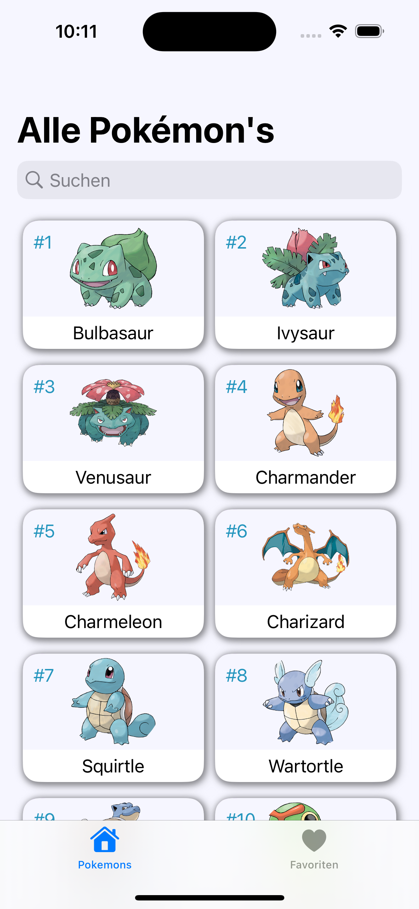
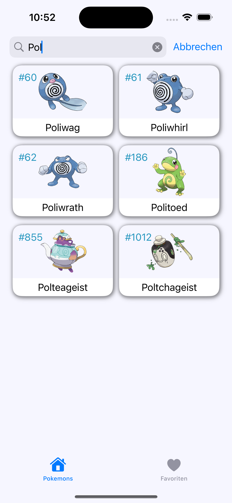
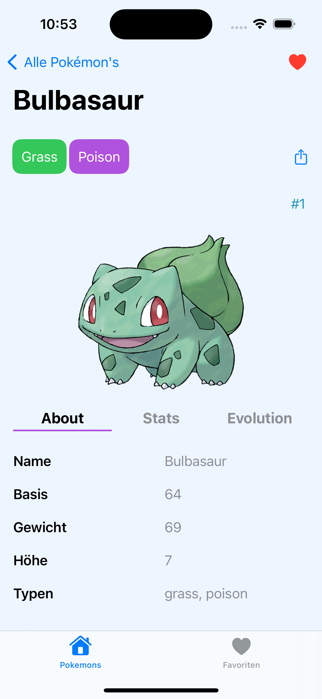
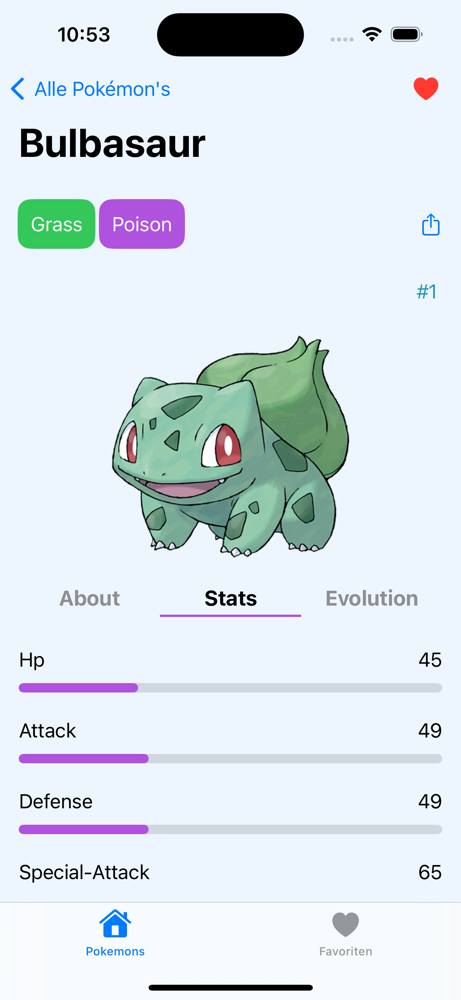
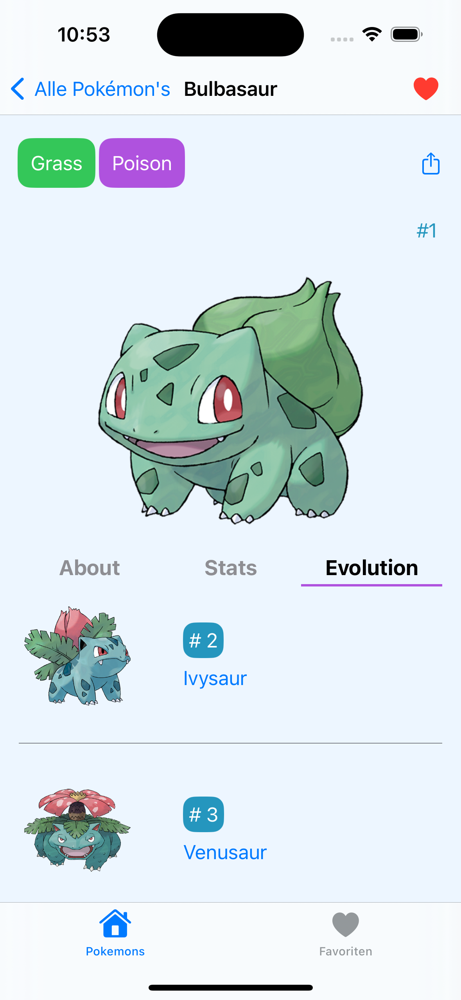
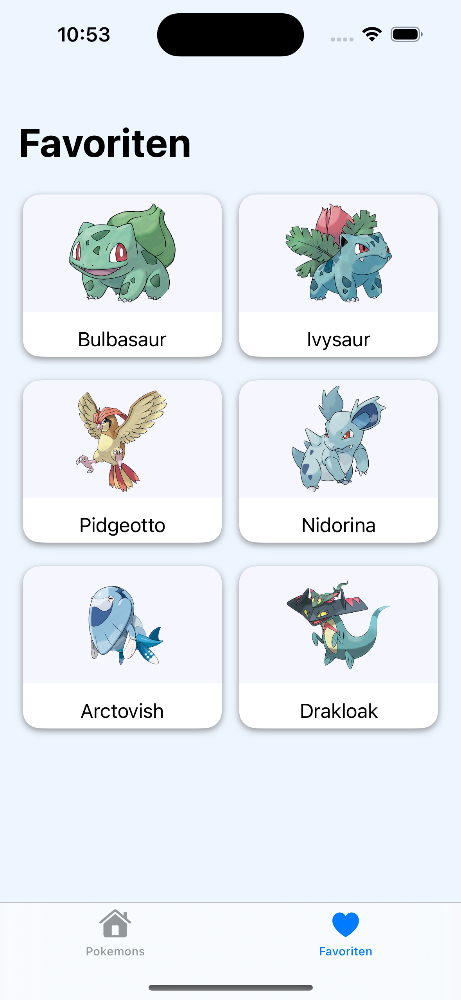

Pokedex App 

<table style="width: 100%;">
  <tr>
    <td align="center" width="33%" style="vertical-align: top; height: 500px;">
       
        <em>List of all Pokemons.</em>
    </td>
    <td align="center" width="33%" style="vertical-align: top; height: 300px;">
       
        <em>Search for Pokemons.</em>
    </td>
    <td align="center" width="33%" style="vertical-align: top; height: 300px;">
       
        <em>About Information about Bulbasaur.</em>
    </td>
  </tr>
  <tr>
    <td align="center" width="33%" style="vertical-align: top; height: 300px;">
       
        <em>Stats Information about Bulbasaur.</em>
    </td>
    <td align="center" width="33%" style="vertical-align: top; height: 300px;">
       
        <em>Evolution Information about Bulbasaur.</em>
    </td>
    <td align="center" width="33%" style="vertical-align: top; height: 300px;">
       
        <em>Alle Pokemons die als Favoriten markiert sind.</em>
    </td>
</table>
